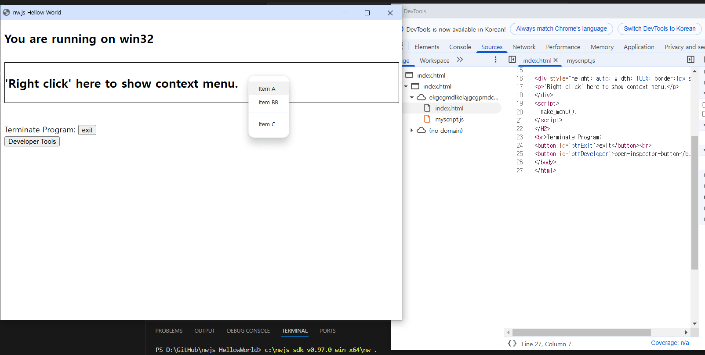

# nw.js-HellowWorld




## Project 생성 절차<br> 
====================================<br>

1. download nwjs-sdk-v0.96.0-win-x64.zip and unzip to c:\nwjs-sdk-v0.96.0-win-x64 folder

2. mkdir nw.js-HellowWorld & cd nw.js-HellowWorld

2. npm init -y                     --> created package.json
```
package.json
{
  "name": "nwjs-hellowworld",
  "version": "1.0.0",
  "description": "",
  "main": "index.html",
  "window": {
    "show": true,
    "toolbar": true
  },
  "scripts": {
    "test": "echo \"Error: no test specified\" && exit 1"
  }
}
```
3.index.html
4.myscript.js

## run program
==================
1. open terminal in vscode
2. c:\nwjs-sdk-v0.96.0-win-x64\nw .


   

